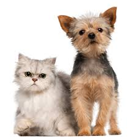
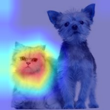
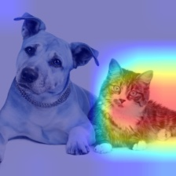
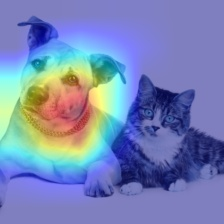

Grad-CAM module
================================================================================================
Grad-CAM pytorch implementation of [original paper](http://openaccess.thecvf.com/content_ICCV_2017/papers/Selvaraju_Grad-CAM_Visual_Explanations_ICCV_2017_paper.pdf).

## Basic Setups
Open [config.py](./config.py), and edit the lines below to your data directory.

```bash
name = [:The name of your dataset that you trained on module 3 (classifier)]
data_base = [:dir to your original dataset]
aug_base =  [:dir to your actually trained dataset]
```

For training, your data file system should be in the following hierarchy.
Organizing codes for your data into the given requirements will be provided in the [preprocessor module](../1_preprocessor)

```bash
[:data file name]

    |-train
        |-[:class 0]
        |-[:class 1]
        |-[:class 2]
        ...
        |-[:class n]
    |-val
        |-[:class 0]
        |-[:class 1]
        |-[:class 2]
        ...
        |-[:class n]
```

## How to run
After you have cloned the repository, you can train the dataset by running the script below.

You can set the dimension of the additional layer in [config.py](./config.py)

```bash
# grad-cam exploits
python launch_model --net_type [:net_type] --depth [:depth]

# For example, for the resnet-50 model I've trained, type
python launch_model --net_type resnet --depth 50
```

## Test out various networks
Before testing out the networks, make sure that you have a trained weight obtained in the checkpoint file of the [classifier module](../2_classifier)

Supporting networks
- AlexNet [:TODO]
- VGGNet  [:TODO]
- ResNet

## Results

- Original Image

 

- Grad-CAM Image

### Attention for cat
 

### Attention for dog
 
