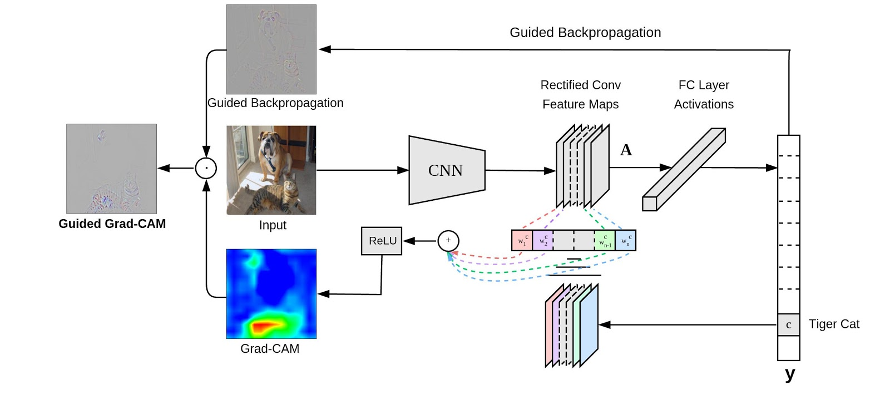

<p align="center"></p>

-------------------------------------------------------------------------------------

This is the repository for Pytorch Implementation of
"Grad-CAM: Visual Explanations from Deep Networks via Gradient-based Localization".
If you have any issues regarding this repository or the paper, please contact meliketoy@gmail.com.

You can see the original paper [here](https://arxiv.org/pdf/1610.02391.pdf)

## Modules
- [#1 Preprocessor](./1_preprocessor)
- [#2 Classifier](./2_classifier)
- [#3 Detector](./3_detector)

## Requirements
See the [installation instruction](INSTALL.md) for a step-by-step installation guide.
See the [server instruction](SERVER.md) for server settup.
- Install [cuda-8.0](https://developer.nvidia.com/cuda-downloads)
- Install [cudnn v5.1](https://developer.nvidia.com/cudnn)
- Download [Pytorch for python-2.7](https://pytorch.org) and clone the repository.
- Enjoy!

```bash
pip install http://download.pytorch.org/whl/cu80/torch-0.1.12.post2-cp27-none-linux_x86_64.whl
pip install torchvision
git clone https://github.com/meliketoy/gradcam.pytorch
```

## Grad-CAM

"Grad-CAM: Visual Explanations from Deep Networks via Gradient-based Localization".



In this repo, we will be training and testing the model with a very simple, [cat vs dog](https://www.kaggle.com/c/dogs-vs-cats) dataset.
You can view and download the dataset yourself by clicking the link above. 


Implementation on your own private data only requires modifications in the directory within the configuration files inside each modules.

### STEP 0 : Data preperation
You can prepare your data with the [preprocessing module](./1_preprocessor).
In the [configuration file](./1_preprocessor/config.py), set the directory to the directory containing the training data.

As we are fine-tuning the model, we will only be taking a small portion of the original training set.

```bash
$ cd ./1_preprocessor
$ python main

> Enter mode name : split # This will make a train-validation split in your 'split_dir' in config.py
> Enter mode name : check # This will print out the distribution of your split.
> Enter mode name : meanstd # This will print out the meanstd value of your train set.
```

Copy the value of meanstd in the third line, and paste it in the configurations of each [module 3](./2_classifier/config.py) and [module 4](./3_detector/config.py). View the [README-preprocessor](./1_preprocessor/README.md) for further instructions.

### STEP 1 : Classification
Then, in the [classifier module](./2_classifier), run the line below
```bash
$ ./scripts/train/resnet
```

This will fine-tune a pre-trained resnet-50 model on your dataset.
To train your network on different models & layers, view the [scripts](./2_classifier/scripts). See [README-classifier](./2_classifier/README.md) for further instructions.

### STEP 2 : Detection
After you have trained your model, there will be a model saved in the [checkpoint directory](./2_classifier/checkpoints).
The files in directory will be automatically updated in the detector module, searched by the directory name of your training set.

In the [configuration of module 4](./3_detector/config.py), match the 'name' variable identical to the 'name' you used in your classification training data directory name.

The heatmap generation for each of the test data can be done by running,
```bash
$ ./scripts/detect.sh
```

This will generate a heatmap which will look like

Implementation in leukocyte detection (which is a paper I'm currently working on) looks like,


See [README-detector](./3_detector/README.md) for further instructions.

### STEP 3 : Result Filtering
Finally, the bounding boxes extracted from the heatmap will be fed again in order to obtain a hierarchy attentive classification of the predicted regions.

You can obtain the inferenced regions with its class predictions and location wrote in csv formats at ["./results/inferenced"](./3_detector/results/inferenced) by running,

```bash
$ ./scripts/inference.sh
```

This will give you a region and a prediction such as,


Implementation on luekocyte detection will look like,


If you want to change the model configuration, see the [script](./3_detector/scripts/inference.sh) or the [configuration file](./3_detector/config.py)
